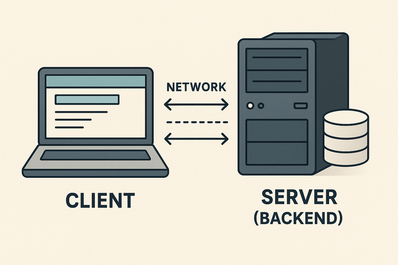
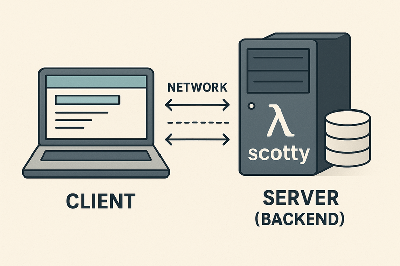

<!--
author:   Andrea Charão

email:    andrea@inf.ufsm.br

version:  0.0.1

language: PT-BR

narrator: Brazilian Portuguese Female

comment:  Material de apoio para a disciplina
          ELC117 - Paradigmas de Programação
          da Universidade Federal de Santa Maria

translation: English  translations/English.md


link:     https://cdn.jsdelivr.net/gh/AndreaInfUFSM/elc117-2026a@main/assets/css/custom.css

script:   https://cdn.jsdelivr.net/gh/AndreaInfUFSM/elc117-2026a@main/assets/js/goatcounter-config.js
script:   https://gc.zgo.at/count.js
-->

<!--
nvm use v14.21.1
npx -p @liascript/devserver liascript-devserver --test --input ./README.md
liascript-devserver --input README.md --port 3001 --live
-->

[](https://liascript.github.io/course/?https://raw.githubusercontent.com/elc117/demo-scotty-codespace-2026a/main/README.md)

# Web Service em Haskell



<script>
  window.goatcounter.count({
    path: "elc117/demo-scotty-codespace-2026a",
    title: "elc117/demo-scotty-codespace-2026a"
  })
</script>

## Framework Scotty

- [Scotty](https://hackage.haskell.org/package/scotty) é um framework em Haskell para desenvolvimento backend de aplicações web
- Comparável com [Flask](https://flask.palletsprojects.com/en/stable/) (Python) ou [Express.js](https://expressjs.com/) (JavaScript/Node.js)
- Requer instalação de algumas bibliotecas adicionais (já inclui um servidor HTTP)



## Exemplos mínimos

Como dizia (polemicamente) Linus Torvalds (criador do Linux):


### Exemplo: hello


Arquivo: [helloScotty.hs](src/01-scotty-hello/helloScotty.hs)

``` haskell
{-# LANGUAGE OverloadedStrings #-}
import Web.Scotty
import Network.Wai.Middleware.RequestLogger (logStdoutDev)

main :: IO ()
main = scotty 3000 $ do
  middleware logStdoutDev

  -- Define your routes and handlers here
  get "/hello" $ do
    text "Hello, Haskell Web Service!"

```
- O servidor/serviço web é uma função que faz IO (recebe e responde requisições web na porta 3000).
- Rotas são funções puras estendidas para a web:

  - O trecho `get "/hello"` define uma rota: quando o cliente acessa `/hello`, o servidor responde com um texto.
  - Cada rota é como um caso de "pattern matching" para diferentes caminhos da URL.
  - O código é **declarativo**: descrevemos o que acontece em cada rota, sem precisar gerenciar detalhes de comunicação (sockets ou protocolos HTTP).
- Importante: diretiva `{-# LANGUAGE OverloadedStrings #-}` permite trabalhar com diferentes representações de strings (como o tipo Text, usado pelo Scotty), sem chamar funções de conversão
- Opcional: a linha `middleware logStdoutDev` é opcional e insere um "middleware" que executa antes/depois de cada requisição, neste caso registrando logs.
- Para saber mais sobre comunicação cliente-servidor web, veja:
  - [Overview of HTTP](https://developer.mozilla.org/en-US/docs/Web/HTTP/Guides/Overview)
  - [HTTP Methods](https://developer.mozilla.org/en-US/docs/Web/HTTP/Reference/Methods)


### Exemplo: hello/name


Arquivo: [helloNameScotty.hs](src/02-scotty-hello-name/helloNameScotty.hs)

``` haskell
{-# LANGUAGE OverloadedStrings #-}
import Web.Scotty
import Network.Wai.Middleware.RequestLogger (logStdoutDev)
import qualified Data.Text.Lazy as T

-- Função pura: recebe um nome e produz a mensagem
makeGreeting :: String -> String
makeGreeting name = "Hello, " ++ name ++ "!"

main :: IO ()
main = scotty 3000 $ do
  middleware logStdoutDev

  get "/hello/:name" $ do
    name <- pathParam "name"
    text (T.pack (makeGreeting name))
```


- Aqui a rota `hello` recebe como parâmetro um nome

- O nome é passado como parâmetro para a função pura `makeGreeting`, que retorna uma `String` que é depois convertida para retorno pelo servidor


## Ambiente de desenvolvimento

### Codespaces

> Todos os códigos deste repositório são executáveis no Codespaces!

- Para isso:

  - Faça login no GitHub
  - Acesse https://github.com/elc117/demo-scotty-codespace-2026a
  - Clique no botão Code -> aba Codespaces -> Create codespace on main
  - Aguarde a criação... (leva algum tempo)


### Instalação de dependências

Instalação de dependências localmente ou no Codespaces, sem criação de projeto:

```
cabal update
cabal install --lib scotty wai-extra random text
cabal install --lib aeson sqlite-simple http-types warp
```

Observações:

- No Codespaces, essas dependências podem ser adicionadas em [.devcontainer/devcontainer.json](.devcontainer/devcontainer.json), mas isso aumentaria o tempo de criação do container
- Opcional para futuros projetos: usar ferramentas Cabal/Stack para criar um projeto que descreve as dependências

  - Para manter os códigos de exemplo "minimalistas", não foi criado um arquivo de projeto (basta o arquivo .hs e as dependências acima instaladas)

  - Criar um projeto não é obrigatório para executar os códigos de exemplo (localmente ou Codespaces)

  - O último exemplo, mais adiante, tem um projeto configurado


### Compilação e execução


Execução do primeiro exemplo, como script:

```
cd src/01-scotty-hello/
runhaskell helloScotty.hs
```

Opcional, com geração de executável:

```
ghc -threaded -o mywebapp helloScotty.hs
./mywebapp
```


### Teste

- Para testar cada exemplo, vai ser preciso fazer requisições web para as rotas 
- Todos exemplos aceitam requisições GET (leitura), que podem ser enviadas pelo navegador na URL
- No Codespaces, é possível expor o serviço (escolher modo Public) com uma URL externa e acessá-lo pelo computador local


#### Codespaces

- Certifique-se de que o programa com Scotty esteja rodando antes de fazer uma requisição (verifique os logs no terminal)

- Para requisições GET, clique em "Open in Browser" no popup que aparece quando o programa é executado

  - Opcionalmente: Clique no menu PORTS e clique na URL mostrada em Forwarded Address
  - Depois de abrir o navegador, digite a rota no final da URL 

- Para controlar melhor as requisições, use o comando `curl` no terminal (abra um segundo terminal, pois o primeiro estará dedicado a executar e mostrar os logs do servidor)

- Exemplos de requisições (conforme o exemplo correspondente):

  - Exemplo: Hello
    ``` bash
    curl http://localhost:3000/hello
    ```
  
- Caso queira enviar requisições a partir do computador local, configure a visibilidade da porta para Public (PORTS -> Visibility). Isso permitirá acessar o serviço via uma URL na forma `https://<nome-gerado-pelo-github>-3000.app.github.dev/users`, como no exemplo abaixo:

  ```
   curl https://effective-journey-5vvrvjp95hp4p5-3000.app.github.dev/users
  ```


#### Localmente

- Opção 1: Abra um navegador e copie/cole a URL: `http://localhost:3000/hello`

- Opção 2: Use o programa `curl` no terminal: 

  ``` bash
  curl http://localhost:3000/hello/Andrea
  ```


## Mais exemplos

### Exemplo: random advice

- Um serviço que fornece conselhos aleatórios 😀
- Arquivo: [randomAdviceService.hs](src/03-scotty-random-advice/randomAdviceService.hs)

``` haskell
{-# LANGUAGE OverloadedStrings #-}

import Web.Scotty
import Network.Wai.Middleware.RequestLogger (logStdoutDev)
import System.Random (randomRIO)
import Control.Monad.IO.Class (liftIO)
import Data.Text.Lazy (Text)

-- List of random advices
-- From https://api.adviceslip.com/advice
advices :: [Text]
advices =
    [ "It always seems impossible, until it's done."
    , "To cleanly remove the seed from an Avocado, lay a knife firmly across it, and twist."
    , "Fail. Fail again. Fail better."
    , "Play is the true mother of invention."
    , "Remedy tickly coughs with a drink of honey, lemon and water as hot as you can take."
    ]

-- Function to get a random advice
-- Using "do" to execute actions step by step, like in "imperative" programming
getRandomAdvice :: IO Text
getRandomAdvice = do
    index <- randomRIO (0, length advices - 1)
    return $ advices !! index

main :: IO ()
main = scotty 3000 $ do
    middleware logStdoutDev
    get "/advice" $ do
        randomAdvice <- liftIO getRandomAdvice   
        text randomAdvice
```

- Backend com resposta dinâmica: diferente da rota estática do exemplo anterior (text "Hello"), aqui a resposta muda a cada requisição.
- O uso de `randomRIO` em `getRandomAdvice` mostra que rotas podem executar ações que envolvem o "mundo externo".
- Com `liftIO`, trazemos esse resultado "imperativo" para dentro do Scotty, integrando lógica Haskell com o servidor web.

### Exemplo: random advice (JSON)

- Agora com resposta em formato JSON
- Arquivo: [randomAdviceServiceJson.hs](src/04-scotty-random-advice-json/randomAdviceServiceJson.hs)

``` haskell
{-# LANGUAGE OverloadedStrings #-}

import Web.Scotty
import Network.Wai.Middleware.RequestLogger (logStdoutDev)
import System.Random (randomRIO)
import Control.Monad.IO.Class (liftIO)
import Data.Text.Lazy (Text, pack, unpack)

-- List of random advices
-- From https://api.adviceslip.com/advice
advices :: [Text]
advices =
    [ "It always seems impossible, until it's done."
    , "To cleanly remove the seed from an Avocado, lay a knife firmly across it, and twist."
    , "Fail. Fail again. Fail better."
    , "Play is the true mother of invention."
    , "Remedy tickly coughs with a drink of honey, lemon and water as hot as you can take."
    ]

-- Function to get a random advice
getRandomAdvice :: IO Text
getRandomAdvice = do
    index <- randomRIO (0, length advices - 1)
    -- Illustrate conversion: String to Text
    -- For a better solution, see https://hackage.haskell.org/package/json
    let advice = advices !! index
        responseString = "{\"advice\": \"" ++ unpack advice ++ "\"}"
        responseText = pack responseString
    return responseText
    -- Shorter version, without JSON formatting:
    -- return $ advices !! index

main :: IO ()
main = scotty 3000 $ do
    middleware logStdoutDev
    get "/advice" $ do
        randomAdvice <- liftIO getRandomAdvice
        setHeader "Content-Type" "application/json"
        text randomAdvice
```

- O código mostra conversões entre Text e String (unpack / pack) para montar uma resposta em formato JSON (com pares chave-valor).
- O `setHeader "Content-Type" "application/json"` controla metadados da resposta, fundamental para APIs.
- Para manipulações mais complicadas usando o formato JSON, é melhor utilizar uma biblioteca ao invés de só usar strings.


### Exemplo: POI service

- Exemplo que consulta um serviço de Pontos de Interesse
- Arquivo: [poiService.hs](src/05-scotty-poi/poiService.hs)


``` haskell
{-# LANGUAGE OverloadedStrings #-}

import Web.Scotty
import Network.Wai.Middleware.RequestLogger (logStdoutDev)
import System.Random (randomRIO)
import Control.Monad.IO.Class (liftIO)
import Data.Text.Lazy (Text, pack, unpack)
import Text.Printf (printf)
import Data.List (intercalate)

-- Latitude and longitude of some Points of Interest at UFSM
poiList :: [(String, Double, Double)]
poiList = [("Centro de Tecnologia", -29.713318, -53.71663),
           ("Biblioteca Central", -29.71566, -53.71523),
           ("Centro de Convenções", -29.72237, -53.71718),
           ("Planetário", -29.72027, -53.71726),
           ("Reitoria da UFSM", -29.72083, -53.71479),
           ("Restaurante Universitário 2", -29.71400, -53.71937),
           ("HUSM", -29.71368, -53.71536),
           ("Pulsar Incubadora Tecnológica - Prédio 2", -29.71101, -53.71634),
           ("Pulsar Incubadora Tecnológica - Prédio 61H", -29.72468, -53.71335),
           ("Casa do Estudante Universitário - CEU II", -29.71801, -53.71465)]


-- Simple functions to convert our POIs to JSON-formatted strings
-- For more robust JSON manipulation, see Aeson (a library for JSON manipulation): 
-- https://hackage.haskell.org/package/aeson
-- https://williamyaoh.com/posts/2019-10-19-a-cheatsheet-to-json-handling.html
poiJsonFormat :: String
poiJsonFormat = "{\"poi\": \"%s\", \"latitude\": \"%s\", \"longitude\": \"%s\"}"

poiToJSONString :: (String, Double, Double) -> String
poiToJSONString (poi,lat,lon) = printf poiJsonFormat poi (show lat) (show lon)

poiListToJSONString :: [(String, Double, Double)] -> String
poiListToJSONString poiList = "[" ++  (intercalate "," $ map poiToJSONString poiList) ++ "]"


-- Function to calculate the distance between 2 points on a sphere, using the 
-- Haversine formula with latitudes and longitudes, as per this tutorial:
-- https://acervolima.com/formula-haversine-para-encontrar-a-distancia-entre-dois-pontos-em-uma-esfera/
calcDistance :: Double -> Double -> Double -> Double -> Double
calcDistance lat1 lon1 lat2 lon2 = 
    let r = 6371.0 -- Earth's radius in km
        dLat = (lat2 - lat1) * pi / 180.0
        dLon = (lon2 - lon1) * pi / 180.0
        a = sin (dLat / 2.0) * sin (dLat / 2.0) +
            cos (lat1 * pi / 180.0) * cos (lat2 * pi / 180.0) *
            sin (dLon / 2.0) * sin (dLon / 2.0)
        c = 2.0 * atan2 (sqrt a) (sqrt (1.0 - a))
    in r * c


-- Main Scotty application
main :: IO ()
main = scotty 3000 $ do
    middleware logStdoutDev  -- Log requests for development

    -- Route to return a hardcoded, sample POI
    get "/poi" $ do
        -- We set the header manually because we are returning a text (manually formatted as json)
        setHeader "Content-Type" "application/json"
        let response = poiToJSONString ("Restaurante Universitário 2", -29.71400, -53.71937)
        text (pack response)

    -- Route to return the POI list in JSON format
    get "/poilist" $ do
        setHeader "Content-Type" "application/json"
        let response = poiListToJSONString poiList
        text (pack response)    

    -- For example: http://localhost:3000/near/-29.71689/-53.72968
    get "/near/:lat/:lon" $ do
        setHeader "Content-Type" "application/json"
        givenLat <- pathParam "lat" :: ActionM Double
        givenLon <- pathParam "lon" :: ActionM Double
        let nearDistance = 1.5::Double
            near = filter isNear poiList
                where
                    distance (_, poiLat, poiLon) = calcDistance givenLat givenLon poiLat poiLon
                    isNear poi = distance poi <= nearDistance
            response = poiListToJSONString near
        text (pack response)
```

- Rota `/near/:lat/:lon` recebe parâmetros latitude e longitude.
- Retorna aqueles mais próximos (filtragem da lista por distância).
- Se o código de cada rota se estender muito, vale movê-lo para outras funções de tipo `IO ()`, que chamam as funções mais "puras" (que não interagem com o "mundo externo").

### Exemplo: SQLite


- Integração de Scotty a um banco SQLite, com operações de inserção, leitura, alteração e remoção.
- Arquivo: [Main.hs](src/06-scotty-sqlite/Main.hs)

``` haskell
{-# LANGUAGE OverloadedStrings #-}
{-# LANGUAGE DeriveGeneric #-}

import Web.Scotty
import Network.HTTP.Types.Status (status404, status500)
import Network.Wai.Middleware.RequestLogger (logStdoutDev)
import Database.SQLite.Simple
import Database.SQLite.Simple.FromRow
import Data.Aeson (FromJSON, ToJSON)
import GHC.Generics (Generic)
import Data.Text.Lazy (Text)
import qualified Data.Text.Lazy as T
import Control.Monad.IO.Class (liftIO)
import Network.Wai.Handler.Warp (HostPreference, defaultSettings, setHost, setPort)
import System.Environment (lookupEnv)
import Text.Read (readMaybe)


-- Define the User data type
data User = User
  { userId   :: Maybe Int
  , name     :: String
  , email    :: String
  } deriving (Show, Generic)

instance ToJSON User
instance FromJSON User

instance FromRow User where
  fromRow = User <$> field <*> field <*> field

instance ToRow User where
  toRow (User _ name_ email_) = toRow (name_, email_)

hostAny :: HostPreference
hostAny = "*"

-- Initialize database
initDB :: Connection -> IO ()
initDB conn = execute_ conn
  "CREATE TABLE IF NOT EXISTS users (\
  \ id INTEGER PRIMARY KEY AUTOINCREMENT,\
  \ name TEXT,\ 
  \ email TEXT)"

-- Main entry point
main :: IO ()
main = do

  conn <- open "users.db"
  initDB conn

  -- pick port: env PORT (Codespaces/Render/Heroku) or default 3000
  mPort <- lookupEnv "PORT"
  let port = maybe 3000 id (mPort >>= readMaybe)

  putStrLn $ "Server running on port:" ++ show port
  let opts = Options
        { verbose  = 1
        , settings = setHost hostAny $ setPort port defaultSettings
        }

  scottyOpts opts $ do
    middleware logStdoutDev
    
    -- GET /healthz (check if the server is running)
    get "/healthz" $ text "ok"  

    -- GET /users
    get "/users" $ do
      users <- liftIO $ query_ conn "SELECT id, name, email FROM users" :: ActionM [User]
      json users

    -- GET /users/:id
    get "/users/:id" $ do
      idParam <- pathParam "id" :: ActionM Int
      result  <- liftIO $ query conn "SELECT id, name, email FROM users WHERE id = ?" (Only idParam) :: ActionM [User]
      if null result
        then status status404 >> json ("User not found" :: String)
        else json (head result)

    -- POST /users
    post "/users" $ do
      user <- jsonData :: ActionM User
      liftIO $ execute conn "INSERT INTO users (name, email) VALUES (?, ?)" (name user, email user)
      rowId <- liftIO $ lastInsertRowId conn
      json ("User created with id " ++ show rowId)

    -- PUT /users/:id
    put "/users/:id" $ do
      idParam <- pathParam "id" :: ActionM Int
      user <- jsonData :: ActionM User
      let updatedUser = user { userId = Just idParam }
      liftIO $ execute conn "UPDATE users SET name = ?, email = ? WHERE id = ?" (name updatedUser, email updatedUser, userId updatedUser)
      json ("User updated" :: String)

    -- DELETE /users/:id
    delete "/users/:id" $ do
      idParam <- pathParam "id" :: ActionM Int
      liftIO $ execute conn "DELETE FROM users WHERE id = ?" (Only idParam)
      json ("User deleted" :: String)
```

- Usa JSON para comunicação entre cliente e servidor, de forma automática via instâncias `ToJSON`/`FromJSON`.
- Mais exemplos de práticas de backend: parâmetros de rota, códigos de status HTTP.


## Deploy em render.com

- O exemplo com banco de dados SQLite está configurado para deploy na plataforma Render (render.com)
- Arquivos importantes

  - [Dockerfile](./Dockerfile): contém comandos para configurar um container (semelhante a uma máquina virtual) com Haskell instalado, instalar biblioteas e compilar o código do exemplo com SQLite 
  - [render.yaml](./render.yaml): configurações da plataforma Render para executar o Dockerfile


### Passos para deploy

1. Acesse [render.com](https://render.com) e faça login
2. Clique em **New +** e escolha **Blueprint**
3. Conecte sua conta do GitHub ao Render, se necessário
4. Em `Public Git Repository`, digite `https://github.com/elc117/demo-scotty-codespace-2026a`
5. Confirme a criação do serviço a partir do arquivo `render.yaml` já presente no repositório. Ele usa o Dockerfile do repositório para instalar dependências e compilar o serviço criado com Scotty
6. Aguarde o build e o deploy inicial (tenha paciência, é demorado)
7. Ao final, abra a URL pública gerada pelo Render

> O `render.yaml` está configurado para deploy automático a cada commit novo no repositório! **Desligue** isso (`off`) se for fazer muitos commits!


### Teste

- Para testar o deploy no Render, é preciso fazer requisições web para as rotas 

- O exemplo com SQLite aceita requisições GET (leitura) e POST (escrita)

- Requisições GET podem ser enviadas pelo navegador na própria URL: https://demo-scotty-codespace-2026a.onrender.com/healthz

- Requisições POST precisam de parâmetros e devem ser enviadas por algum programa, por exemplo `curl`

  ```
  curl http://https://demo-scotty-codespace-2026a.onrender.com/users \
      -H "Content-Type: application/json" \
      -d '{"name":"Fulano","email":"fulano@email.com"}'
  ```


## Links

- [Build a Haskell Server with Scotty framework](https://www.youtube.com/watch?v=psTTKGj9G6Y)
- [Overview of HTTP](https://developer.mozilla.org/en-US/docs/Web/HTTP/Guides/Overview)
- [HTTP Methods](https://developer.mozilla.org/en-US/docs/Web/HTTP/Reference/Methods)